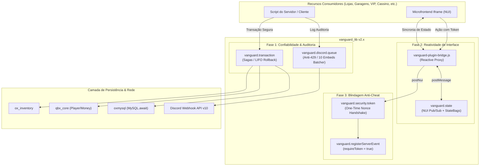

# 📋 Plano de Implementação: Vanguard Library v2.x — Roadmap Completo

> **Projeto:** vanguard_lib v2.x (Distrito Paulista)  
> **Estratégia Aprovada:** Roadmap Gradual (Fase 1: A + B ➡️ Fase 2: C ➡️ Fase 3: D)  
> **Status:** Pronto para Aprovação & Execução da Fase 1  

---

## 🎯 Objetivo & Escopo

Transformar o `vanguard_lib` no coração operacional e de segurança do ecossistema Vanguard (Distrito Paulista), entregando quatro subsistemas de ponta:

1. **Fase 1 (Alta Prioridade - Imediato):**
   - **Opção A (`vanguard.transaction`):** Gerenciador de transações atômicas com padrão Saga e compensação reversa LIFO (Rollback automático para dinheiro, inventário e MySQL).
   - **Opção B (`vanguard.discord.queue`):** Buffer assíncrono e compactador de embeds do Discord com proteção contra rate-limit 429 e prioridades (urgent/normal/bulk).
2. **Fase 2 (Reatividade NUI):**
   - **Opção C (`vanguard.state`):** Barramento de sincronização global reativo entre o menu ESC (`vanguard_esc`) e todos os microfrontends iframes filhos.
3. **Fase 3 (Segurança Criptográfica):**
   - **Opção D (`vanguard.security.token`):** Handshake de ações sensíveis por One-Time Token descartável com validação no middleware declarativo contra injeção de eventos por executores de cheat.

---

## 🏗️ Arquitetura do Sistema v2.x

---

## 📦 Especificação Detalhada por Fase

---

### 🔹 FASE 1: Transações Atômicas (A) + Fila de Webhooks (B)

#### 1. Componente: `vanguard.transaction` (`server/transaction.lua`)
- **Padrão:** Saga Pattern com rollback LIFO (Last-In, First-Out).
- **Recursos Nativos:**
  - `tx:removeMoney(moneyType, amount, reason)` ➡️ compensa com `addMoney`.
  - `tx:addMoney(moneyType, amount, reason)` ➡️ compensa com `removeMoney`.
  - `tx:addItem(item, count, metadata)` ➡️ compensa com `removeItem`.
  - `tx:removeItem(item, count, metadata)` ➡️ compensa com `addItem`.
  - `tx:step({ name, execute, compensate })` ➡️ passos customizados com rollback programado.
  - `tx:dbInsert(query, params, tableName)` ➡️ compensa com exclusão do ID inserido.
- **Fail-Safe & Auditoria:**
  - Se um rollback falhar (ex: jogador desconectou no meio do rollback), emite um evento de log de emergência para o webhook administrativo (`CRITICAL_COMPENSATION_FAILED`).
  - Mutex de transação por jogador: impede que o mesmo `source` execute duas transações simultâneas que disputam os mesmos recursos (elimina race condition).

#### 2. Componente: `vanguard.discord.queue` (`server/discord_queue.lua`)
- **Compactador de Embeds:** Agrupa até 10 embeds em uma única chamada HTTP POST.
- **Filas Prioritárias:**
  - `urgent` (Anticheat, Bans, Falhas Críticas): Despacho em até 250ms.
  - `normal` (Transações financeiras, compras, garagens): Despacho em 2.000ms.
  - `bulk` (Entradas, saídas, duty de facções): Despacho em 5.000ms.
- **Gestão de Rate-Limit 429:**
  - Lê cabeçalhos `x-ratelimit-reset-after` e corpo `retry_after`.
  - Pausa a fila do canal específico até a liberação do cooldown pelo Discord.
  - Buffer circular em memória com capacidade máxima de 3.000 mensagens (proteção contra vazamento de memória).

#### Arquivos Modificados/Criados na Fase 1:
- `[NEW]` [server/transaction.lua](file:///home/bases/mri_paulista/resources/[vanguard]/vanguard_lib/server/transaction.lua)
- `[NEW]` [server/discord_queue.lua](file:///home/bases/mri_paulista/resources/[vanguard]/vanguard_lib/server/discord_queue.lua)
- `[MODIFY]` [server/framework.lua](file:///home/bases/mri_paulista/resources/[vanguard]/vanguard_lib/server/framework.lua) (expor adapters de itens `AddItem`/`RemoveItem`)
- `[MODIFY]` [init.lua](file:///home/bases/mri_paulista/resources/[vanguard]/vanguard_lib/init.lua) (exportar `vanguard.transaction` e `vanguard.discord.log`)
- `[MODIFY]` [fxmanifest.lua](file:///home/bases/mri_paulista/resources/[vanguard]/vanguard_lib/fxmanifest.lua) (adicionar os novos scripts server-side)
- `[MODIFY]` [README.md](file:///home/bases/mri_paulista/resources/[vanguard]/vanguard_lib/README.md) (documentar as novas APIs)

---

### 🔹 FASE 2: State Store Reativa para Microfrontends (C)

#### 1. Componente: `vanguard.state`
- Barramento de mensagens postMessage com contrato:
  - `mri-state/init`: Entrega o snapshot inicial das stores.
  - `mri-state/set`: Atualiza uma chave específica.
  - `mri-state/patch`: Atualiza um objeto de chaves.
  - `mri-state/sync`: Broadcast do host para todos os iframes ativos.
- Integração reativa no `vanguard-plugin-bridge.js`:
  - `plugin.state.get(key)`
  - `plugin.state.set(key, val)`
  - `plugin.state.subscribe(key, callback)`
  - Suporte out-of-the-box para Alpine.js via `$vState`.
- Sincronização Server ➡️ Client ➡️ NUI através de StateBags nativos do FiveM ou NetEvents dedicados.

#### Arquivos da Fase 2:
- `[NEW]` `js/vanguard-state-store.js`
- `[MODIFY]` [js/vanguard-plugin-bridge.js](file:///home/bases/mri_paulista/resources/[vanguard]/vanguard_lib/js/vanguard-plugin-bridge.js)
- `[NEW]` `client/state.lua`
- `[NEW]` `server/state.lua`

---

### 🔹 FASE 3: Handshake Anti-Executor por One-Time Token (D)

#### 1. Componente: `vanguard.security.token`
- Prevenção de injeção direta de eventos (`TriggerServerEvent`) por executores de cheat (Eulen, RedEngine).
- Geração de tokens de uso único (Nonce) emitidos a partir do callback de clique na NUI.
- Ciclo de Vida do Token:
  - O jogador clica no botão dentro do iframe.
  - O Iframe solicita a emissão do token via NUI bridge.
  - O servidor emite um token temporal assinado com TTL curto (5 segundos) associado ao `(source, actionName)`.
  - O evento é disparado contendo o token como primeiro argumento.
  - O middleware do servidor valida o token, consome-o (Single-Use) e executa o código.
  - Se o token for nulo, expirado ou reutilizado: a ação é bloqueada, gerando ban/alerta de anticheat.

#### Arquivos da Fase 3:
- `[NEW]` `server/security_token.lua`
- `[NEW]` `client/security_token.lua`
- `[MODIFY]` [server/ratelimit.lua](file:///home/bases/mri_paulista/resources/[vanguard]/vanguard_lib/server/ratelimit.lua)
- `[MODIFY]` [init.lua](file:///home/bases/mri_paulista/resources/[vanguard]/vanguard_lib/init.lua)
- `[MODIFY]` [js/vanguard-plugin-bridge.js](file:///home/bases/mri_paulista/resources/[vanguard]/vanguard_lib/js/vanguard-plugin-bridge.js)

---

## 🧪 Plano de Verificação

### Fase 1:
1. **Teste Unitário/Sintaxe:**
   - Validação de compilação Lua 5.4 sem erros de parsing.
2. **Teste de Transação (Cenário de Sucesso):**
   - Cobrança de dinheiro + adição de item + insert SQL ➡️ Tudo executado e comitado.
3. **Teste de Transação (Cenário de Falha & Rollback):**
   - Cobrança de dinheiro ➡️ Tentativa de adicionar item com inventário cheio / erro simulado ➡️ Dinheiro estornado com sucesso e sem duplicação.
4. **Teste de Fila do Discord (Simulação de Carga):**
   - Disparo de 25 logs simultâneos no mesmo canal ➡️ Verificação de compactação em 3 requisições HTTP (10 + 10 + 5) sem tomar 429.

---

## 🚦 Próximo Passo

Aprovar a execução da **Fase 1 (Opções A e B)** para iniciarmos a codificação dos módulos [server/transaction.lua](file:///home/bases/mri_paulista/resources/[vanguard]/vanguard_lib/server/transaction.lua) e [server/discord_queue.lua](file:///home/bases/mri_paulista/resources/[vanguard]/vanguard_lib/server/discord_queue.lua).
